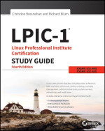
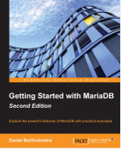
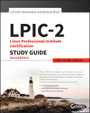
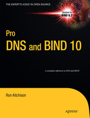
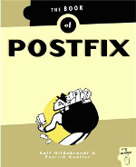
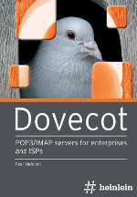
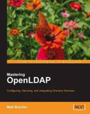

# لیست مطالعه لینوکس 
این بخش ار مطلب می شه بخش اصلی و هدف این مستند است. یعنی تبدیل شدن به یک Linux System Administrator. در این بخش به معرفی کتاب‌های مناسب برای یادگیری سیستم عامل لینوکس و سرویس‌های لینوکسی و متن‌باز/آزاد خواهیم پرداخت

### [Linux Essentials – منتشر شده توسط Linup](https://golinski.faculty.wmi.amu.edu.pl/sop-en/linux-esentials-manual.pdf)
این کتاب مربوط به اولین آزمون موسسه LPI کاناداست. کتاب مناسبی برای شروع کار را لینوکس و خط فرمان می باشد که به صورت آزاد منتشر شده است.

 

{:style="float: left;margin-right: 15px;margin-top: 25px; width:150px"}

### LPIC-1 Linux Professional Institute Certification Study Guide – انتشارات Sybex چاپ چهارم ۲۰۱۵
این کتاب مربوط به آزمون LPIC-1 ، اولین آزمون حرفه ای موسسه LPI کاناداست. این کتاب دو آزمون ۱۰۱-۴۰۰ و ۱۰۲-۴۰۰ را پوشش می دهد و شروع بسیار خوبی برای تبدیل شدن به یک Junior Linux System Administrator است.

 
 
 

{:style="float: left;margin-right: 15px;margin-top: 25px; width:150px"}

### Getting Started with MariaDB – انتشارات Packt Publishing چاپ دوم
این کتاب یک شروع خوب برای کار با دیتابیس است. یک مدیر سیستم به میزان مناسبی باید از نحوه کار با دیتابیس و مدیریت سرویس آن مطلع باشد.

 
 
 

{:style="float: left;margin-right: 15px;margin-top: 25px; width:150px"}

### LPIC-2 Linux Professional Institute Certification Study Guide, 2nd Edition – انتشارات Sybex چاپ دوم ۲۰۱۶
این کتاب یک شروغ برای تبدیل شده شما به یک Senior Linux SystemcAdministrator است. نکته مهم آن است که تنها یک شروع است و برای عمیق شدن در سرفصل‌های آن برای هر سرویس نیاز است که شما کتاب و مستندات مرتبط با آن را به طور مجزا مطالعه کنید. در ادامه به معرفی کتاب در مورد سرویس‌ها مهم خواهیم پرداخت.

 
 
 

{:style="float: left;margin-right: 15px;margin-top: 25px; width:150px"}

### Pro DNS and ‌Bind 10 – انتشارات Apress
این کتاب یکی از بهترین کتاب‌ها در مورد سرویس DNS و به طور خاص سرویس Bind است. آن را به طور کامل مطالعه کنید و در خوندنش تنبلی نکنید.

 
 
 
 

{:style="float: left;margin-right: 15px;margin-top: 25px; width:150px"}

### Then Book of Postfix – انتشارات No Starch سال ۲۰۰۵
یک کتاب خیلی خوب در مورد Postfix به همراه چند سناریوی مفید و پیاده سازی آن. شروع خوبی برای کار کردن با سرویس Email است.

 
 
 

{:style="float: left;margin-right: 15px;margin-top: 25px; width:150px"}

### Dovecot: POP3/IMAP Servers for Enterprises and ISPs
این کتاب تنها کتاب موجود در مورد Dovecot است که متاسفانه هنوز به صورت pdf موجود نیست و باید به صورت چاپی تهیه کنید. در این کتاب به معرفی سرویس dovecot و سرویس‌های pop و imap می پردازند.

 
 
 

{:style="float: left;margin-right: 15px;margin-top: 25px; width:150px"}

### Mastering OpenLDAP – انتشارات Packt Publishing
یک کتاب بسیار خوب برای فراگیری سرویس OpenLDAP. برای مطالعه این کتاب باید زمان مناسبی را اختصاص بدید. در نرم افزارهای سازمانی، در محیط‌های مختلط و شبکه های بزرگ بسیار مورد استفاده است.
