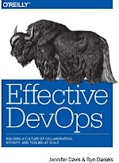
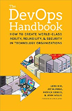
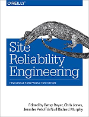
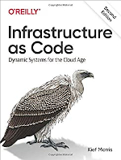

# لیست مطالعه فرهنگ و مدیریت

{:style="float: left;margin-right: 15px;margin-top: 25px; width:150px"}

### Effective DevOps
یک کتاب خیلی ساده و روان از تجربه چند نفر در مورد DevOps در شرکت‌هاشون و تعریف های بسیار روان و قوی. حتی به صورت کتاب مرجع هم می‌تونید ازش استفاده کنید. خیلی خوب Pattern ها و Anti Pattern ها و روش‌ها را پیش روتون می‌زاره.

 
 
 

{:style="float: left;margin-right: 15px;margin-top: 25px; width:150px"}

### DevOps Handbook
جزو کتاب‌های پایه‌ای و قدیمی در مورد DevOps که هم یکم سخت نوشته شده و هم سخت گیر می‌یاد. من مجبور شدم بخوام اصلش را کسی برام تهیه کنه. ولی اگه دنبال مرجع واقعی در مورد DevOps می گردید این کتاب توسیه می‌شه. فقط تو خوندنش باید صبور باشید ;)

 
 
 

{:style="float: left;margin-right: 15px;margin-top: 25px; width:150px"}

### Site Reliability Engineering
برای درک SRE و پیاده سازی روندها می‌تونید از این کتاب استفاده کنید. شما می تونید موضوعات مختلفی مثل Monitoring, Postmortem, Oncall, Incident management و ... را با کمک الگوهای این کتاب پیاده سازی کنید. یک نسخه آنلاین از این کتاب هم موجوده که میتونید از [سایت گوگل](https://sre.google/sre-book/table-of-contents/) آنلاین مطالعه‌اش کنید.

 
 
 

{:style="float: left;margin-right: 15px;margin-top: 25px; width:150px"}

### Infrastructure as Code Dynamic Systems for the Cloud Age
اگه فکر می‌کنید همین که همه چیز را با Ansible اجرا می کنید شما IaC را تو سازماتون دارید، یه نگاهی به Antipattern هاش بندازید ;)  

