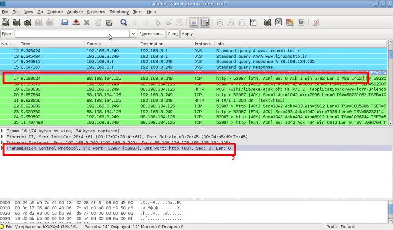

# راهنمای استفاده از wireshark
یه بخشی از مباحث موجود در +Network آشنایی با پروتکل هاست. به طور معمول این آشنایی روی تخته و با تعدادی شکل توضیح داده می شه. ولی یک روش خوب برای درک این مطلب استفاده از نرم افزارهای sniffer است. من برای آشنایی ملموس تر پروتکل ها برای دوستانی که در کلاس +Network شرکت می کنند این راهنما را آماده کردم تا بتونند عینا رد و بدل شده بسته و محتوای بسته هارا ببینند.

## دریافت نرم افزار wireshark
نرم افزار wireshark به صورت آزاد منتشر می شود به همین علت می توانید آن را در تمام توزیع های لینوکس پیدا کنید. کافیه مدیر بسته های محبوب خودتون مانند apt یا yum را انتخاب کنید و بسته wireshark را از طریق مخازن نصب نمایید.

برای نصب بر روی ویندوز فایل نصب آن را از [اینجا](http://www.wireshark.org/download/win32/wireshark-win32-1.6.4.exe) دریافت کنید و بر روی سیستم خود نصب نمایید (نصب ویندوز را که توضیح نمی دند ;-) )

برای نصب روی لینوکس اوبونتو 
```
# apt-get install wireshark
```

## استفاده از نرم افزار
برای شروع sniff (زیر نظر گرفتن ترافیک شبکه)کردن ترافیک شبکه اول باید اینترفیس مورد نظر خودتون را انتخاب کنید. برای این کار می توانید هم از طریق لیستی که در شکل ۱ با شماره ۲ مشخص شده است اقدام کنید. هم می توانید شماره ۱ در شکل ۱ را فشار دهید و در بخشی که در شکل ۲ مشخص شده است، نام اینترفیس مورد نظر خود را انتخاب کنید. (دقت کنید که این عکس های در سیستم عامل لینوکس تهیه شده است، بنابراین نام اینترفیس ها با آنچه در ویندوز موجود است متفاوت می باشد. در ویندوز شما باید به دنبال نام Local area connection بگردید.


در صورتی که از قسمت ۲ شکل ۱ اینترفیس مورد نظر خود را انتخاب کردید، با کلیک بر روی اسم اینترفیس نرم‌افزار سریعا شروع به کار می‌کند. در غیر این صورت باید اینترفیس را در منوی مشابه شکل ۲ انتخاب کنید و سپس کلید start را فشار دهید.


با فشار داده کلید start برنامه مانند شکل ۳ شروع به کار می کند. شما کافیست بر روی یکی از ارتباطات tcp کلیک کنید (بخش ۱ شکل ۳) و سپس مشخصات و ساختار بسته را در زیر آن (بخش ۲ شکل ۳) مشاهده کنید. در بخش ۲ شکل ۳ نیز کافیست بر روی پروتکل مورد نظر دوبار کلیک کنید تا بتوانید مشخصات را به طول کامل مشاهده نمایید.



در صورتی که ترافیک زیادی رد می شود و شما می خواهید در خروجی تنها بسته های مورد نظر خود را ببینید می توانید از فیلتر ها استفاده کنید. برای مثال من در شکل ۴ مشخص کرده ام که تنها بسته‌هایی که پورت tcp آنها 80 است مشاهده شود. 


در جدول زیر لیست کوچکی از فیلتر هایی که می توانید مانند tcp.port استفاده کنید آورده شده است.

| فیلتر     | توضیح       | مثال          |
|-------|--------|-------|
| eth.addr    | فیلتر بر مبنای آدرس mac     | eth.addr == 00:1a:6b:ce:fc:bb        |
| eth.src    | فیلتر بر مبنای آدرس mac مبدأ    | eth.src == 00:1a:6b:ce:fc:bb        |
| eth.dst    | فیلتر بر مبنای آدرس mac مقصد    | eth.dst == 00:1a:6b:ce:fc:bb        |
| ip.addr    | فیلتر بر مبنای آدرس IP    | ip.addr == 10.10.10.10       |
| ip.src    | فیلتر بر مبنای آدرس IP مبدأ   | ip.src == 10.10.10.10        |
| ip.dst    | فیلتر بر مبنای آدرس IP مقصد   | ip.dst == 10.10.10.10        |
| tcp.port    | فیلتر بر مبنای شماره پورت tcp   | tcp.port == 20        |
| tcp.dstport | فیلتر بر مبنای شماره پورت tcp مقصد    | tcp.dstport == 20        |
| tcp.srcport | فیلتر بر مبنای شماره پورت tcp مبدأ    | tcp.srcport == 20        |
| udp.port    | فیلتر بر مبنای شماره پورت udp    | udp.port == 20        |
| udp.dstport | فیلتر بر مبنای شماره پورت udp مقصد    | udp.dstport == 20       |
| udp.srcport    | فیلتر بر مبنای شماره پورت udp مبدأ    | udpsrc.port == 20        |


## چند ترفند
### Flow Graph
برای اینکه بتونید یک گراف ساده از بسته های رد و بدل شده ببینید و روند تبادل بسته ها (مانند Three way handshake) را رصد کنید، پس از آنکه از ترافیک مورد نظرتون داده های لازم را جمع آوری کردید، وارد منوی Statistics شوید و Flow graph را انتخاب می کنید. 


در پنجره باز شده TCP flow را انتخاب کنیدو دکمه Ok بزنید.

### Relative SEQ و ACK
یکی از مسايلی که موقع مرور خروجی های نرم افزار بررسی می کنید به آن بر می خورید، شروع مقادیر SEQ از عدد ۱ است (نه مقداری تصادفی) این جایگزینی توسط نرم افزار برای ساده کردن مرور خورجی ها انجام می شود. شما هم می توانید در بخش پایینی خروجی مقدار واقعی را پیدا کنید و هم می توانید این ویژگی را غیر فعال کنید.

برای غیر فعال کردن آن منوی edit گزینه preferences را انتخاب کنید. در صفحه باز شده در قسمت protocol مقدار tcp را انتخاب نمایید. و در قسمت سمت راست گزینه های Analyze tcp sequence numbers و  Relative sequence numbers and window scaling را غیر فعال کنید.


