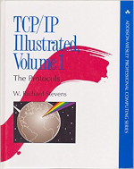

# لیست مطالعه شبکه
اینکه کل داستان چیزایی که ما داریم کار می‌کنیم چطوری کاری می کنه و چه شکلی به هم وصل شده، یکی از موضوعات خیلی مهمه. اکثر موقع‌ها ضعف در عیب یابی سرویس‌ها و نداشتن فرضیات درست برای پیگیری یک مشکل ناشی از عدم درک زیرساخت شبکه‌ای هست که داریم روش کار می‌کنیم.
برای همین به نظرم بخش مهمی از داستان را شبکه تشکیل می ده. نکته بدش این هست که وقتی linux sysadmin یا devop engineer می‌شی معمولا مستقیما مسئول شبکه نیستی و این موضوع باعث می‌شه انگیزه اکثر آدمها نسب به صرف زمان در مباحث شبکه کم بشه.

{:style="float: left;margin-right: 15px;margin-top: 25px; width:150px"}

### راهنمای مطلق +Network (مترجم بهرام پاشایی)

در بین کتابهای +Network جزو بهترین ‌ها بود. البته کمی قدیمی است. شما پس از مطالعه این کتاب (یا شاید همزمان) باید به چند تا مهارت عملی هم برسید

الف. عیب یابی ابتدای شبکه و کار کردن با ابزارهای ping, traceroute, netstat, nslookup

ب. کار با ابزارهای ساده کابل کشی (cabling)، مانند Crimper، Striper و … . پیشنهاد می کنم جعبه ابزاری برای خودتون تهیه کنید که شامل ابزارهای اولیه کابل کشی باشه.

به غیر از این دو مورد یادگیری لایه‌های شبکه در ابتدای کار خیلی مهمه و همیشه هم دست کم گرفته شده. اگه نتونستید در ابتدای کار درکش کنید حفظش کنید. شبیه جدول ضرب. لایه‌های شبکه علاوه بر اینکه در درک بسیاری از موضوعات اهمیت داره، جزوی از دستور زبان مکالمه فنی شما در آینده نیز هست.

برای اینکه بهتر درک کنید از Network+ باید چه توقعی داشته باشید، من زمانی که تدریس می کردم یه شکل دستی کشیدم. در حقیقت شما باید اجزای این شکل را در آخر درک کنید و ارتباطات منطقی بینشون را بفهمید.

{:style="float: left;margin-right: 15px;margin-top: 25px; width:150px"}

### اصول طراحی شبکه های کامپیوتری (احسان ملکیان)

یکی از بهترین کتاب‌ها است که دید خوبی در مورد انواع شبکه بهتون می‌ده. برای شروع کتاب خیلی خوبیه. این کتاب را می تونید فصل‌های زیادیش را اگه براتون جالب نیست بپرید. مثلا شاید شبکه های بی سیم براتون جذاب نباشه و واقعا نیازتون هم نمی شه و می تونید نخونیدش.
 
 
 
 

{:style="float: left;margin-right: 15px;margin-top: 25px; width:150px"}

### معرفی کتاب مرجع: TCP/IP Illustrated, Vol. 1: The Protocols – نوشته W. Richard Stevens
یکی از کتابهای خوب به عنوان مرجع که قدیمی هم هست ولی همچنان به نظرم می تونه مفید باشه. داشتن این کتاب کنارتون و مطالعه پروتکل ها خیلی به درکتون از شبکه کمک می کنه

