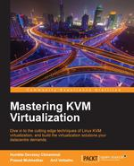
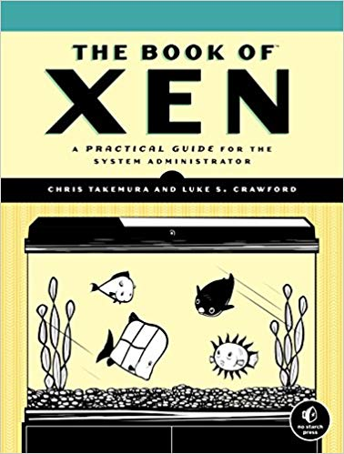

# لیست مطالعه مجازی سازی 

{:style="float: left;margin-right: 15px;margin-top: 25px; width:150px"}

### Mastering KVM Virtualization
این کتاب جزو معدود کتابهای موجود در مورد KVM هست. در این موضوع می‌تونید به کتابهای مجازی سازی Redhat هم مراجعه کنید. ولی بهترین روش مطالعه خوندن مستندات مرتبط هست.   
من یه لیست مطالعه برای آزمون LPIC-304 در [Github](http://github.com/behradeslamifar/Linux-Professional-Institute-Certifications/tree/main/LPI304) جمع آوری کردم می تونید اونها را هم مطالعه کنید.

 
 
 

{:style="float: left;margin-right: 15px;margin-top: 25px; width:150px"}

### The Book of Xen
یک کتاب قدیمی در مورد Xen ولی همچنان کاربردی و قابل استفاده . در این مورد هم به لیست مطالعه در [Github](http://github.com/behradeslamifar/Linux-Professional-Institute-Certifications/tree/main/LPI304) مراجعه کنید بد نیست.
